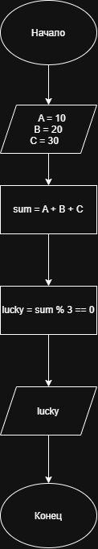

# Домашнее задание к работе 4

## Условие задачи

### 6. Команда мечты

Тренер формирует стартовый состав из трех игроков с номерами **A, B и C**.

Он считает, что это "счастливая" тройка, если сумма номеров игроков делится на три без остатка.

Запишите условие для "счастливой" тройки.

## 1. Алгоритм и блок-схема

### Алгоритм

1. **Начало**
2. Задать номера трех игроков:
   * `A = 10`
   * `B = 20`
   * `C = 30`
3. Вычислить сумму номеров игроков:
   * `sum = A + B + C`
4. Проверить, делится ли сумма номеров на 3 без остатка:
   * `sum % 3 == 0`
5. Если условие выполняется, вывести `1`.
6. Если условие не выполняется, вывести `0`.
7. **Конец**

### Блок-схема




## 2. Реализация программы

```cpp
#include <stdio.h>

int main()
{
    int A = 10;
    int B = 20;
    int C = 30;

    int sum = A + B + C;

    int lucky = sum % 3 == 0;

    printf("Номер первого игрока: %d\n", A);
    printf("Номер второго игрока: %d\n", B);
    printf("Номер третьего игрока: %d\n", C);
    printf("Сумма номеров: %d\n", sum);
    printf("Счастливая тройка (1 - да, 0 - нет): %d\n", lucky);

    return 0;
}

```

## 3. Результаты работы программы


После запуска программы получаем:

```text
Номер первого игрока: 10
Номер второго игрока: 20
Номер третьего игрока: 30
Сумма номеров: 60
Счастливая тройка (1 - да, 0 - нет): 1
```

## 4. Информация о разработчике

**Фамилия:** Гусакова

**Имя:** Ксения

**Группа:** БИЦТ-261
